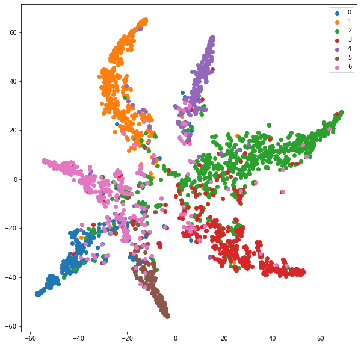

# Graph-Attention-Networks

University project for the course "Neural Networks for Data Science". The aim of the project is to re-implement Graph Attention Network's architecture using Tensorflow in order to obtain comparable results with the state-of-the-art paper [(Veličković et al., ICLR 2018)](https://arxiv.org/abs/1710.10903).

Graph Attention Network             |  T-sne
:-------------------------:|:-------------------------:
         |  
